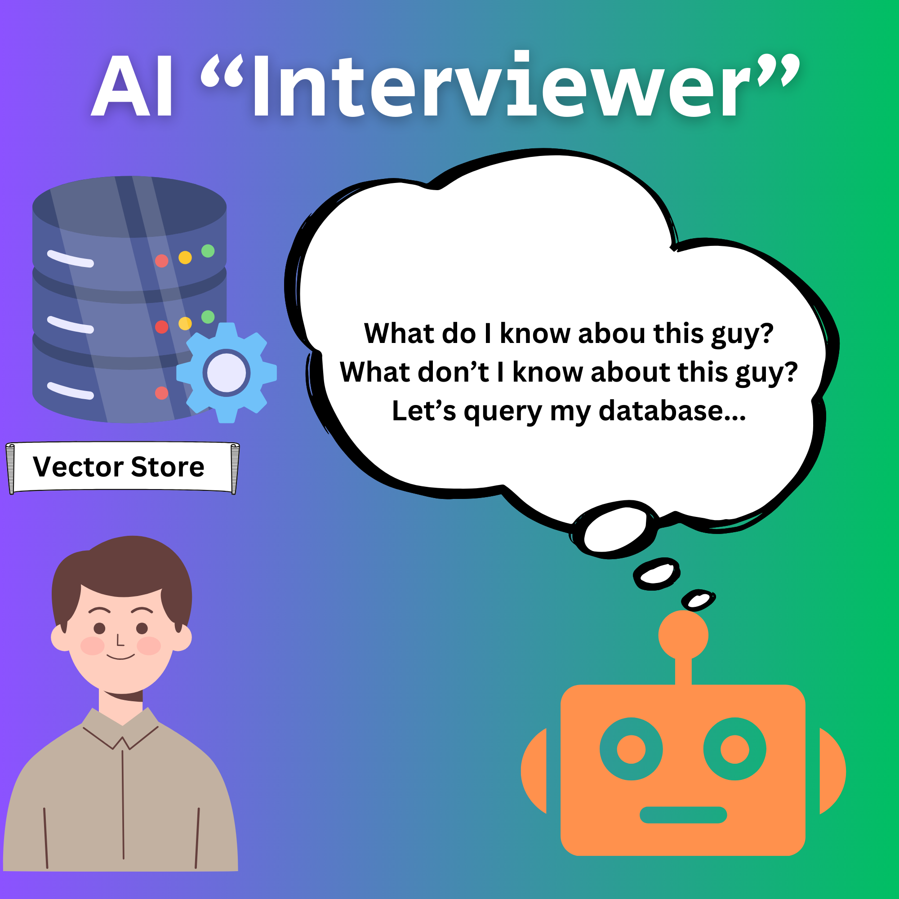

# AI Interviewer Workflow - V2

*09-Feb-25*

## Background Context

I'm fascinated by the idea that by taking a deliberate approach to personal context data generation, we (users) could develop something like a narrow imprint of our lives and interests. 

I'm motivated by the idea that while AI is fantastic, the type of highly personal data that can ground context is properly ours and not that of the providers whose platforms we may use. This and other experiments are nothing more than sketches for how we could develop our own personal context pool and patch it into whatever system we felt comfortable enough with. 

This model is one of several that I've been experimenting with as methods of speeding up the generating this data so that we (AI geeks?) can see if it's actually an effective approach (or not). 

The "meta" experiment is spending enough time answering questions to gather up a rich enough pool of contextual data that it might make notable difference in inference relevance  (or it may not!). One can only try.

My previous workflow configurations have leveraged randomisation: the bot fires off questions (perhaps coaxed into a focus area) and the user answers them. My idea for this model is that by connecting the "interview" bot to a context store, we could make the interview process more efficient. 

The idea is that over time the user's pool of contextual data grows richer and more nuanced. So the questions-and-answers sessions might likewise become deeper and more probative.

The workflow model, in diagram format, is something like this:

## User enters chat, bot begins with a warm-up prompt

Ask the user whether there's a particular subject they'd like to discuss or whether they'd like the bot to ask questions in general.

Bot proactively (or reactively in the guided workflow) tries to find gaps in the knowledge pool:

The user is spared the annoyance of having to answer questions they've already covered.  

As in other sketches for this approach, the bot's "task" now moves to phase two: parsing, summarising:

Interview agent passes new context data to database (embedding pipeline):

The goal: the user's context repository grows over time. Perhaps it reaches a useful plateau, containing just enough information as the user wants to curate. Or it grows incrementally. 

---

## Author

Daniel Rosehill  
(public at danielrosehill dot com)

## Licensing

This repository is licensed under CC-BY-4.0 (Attribution 4.0 International) 
[License](https://creativecommons.org/licenses/by/4.0/)

### Summary of the License
The Creative Commons Attribution 4.0 International (CC BY 4.0) license allows others to:
- **Share**: Copy and redistribute the material in any medium or format.
- **Adapt**: Remix, transform, and build upon the material for any purpose, even commercially.

The licensor cannot revoke these freedoms as long as you follow the license terms.

#### License Terms
- **Attribution**: You must give appropriate credit, provide a link to the license, and indicate if changes were made. You may do so in any reasonable manner, but not in any way that suggests the licensor endorses you or your use.
- **No additional restrictions**: You may not apply legal terms or technological measures that legally restrict others from doing anything the license permits.

For the full legal code, please visit the [Creative Commons website](https://creativecommons.org/licenses/by/4.0/legalcode).